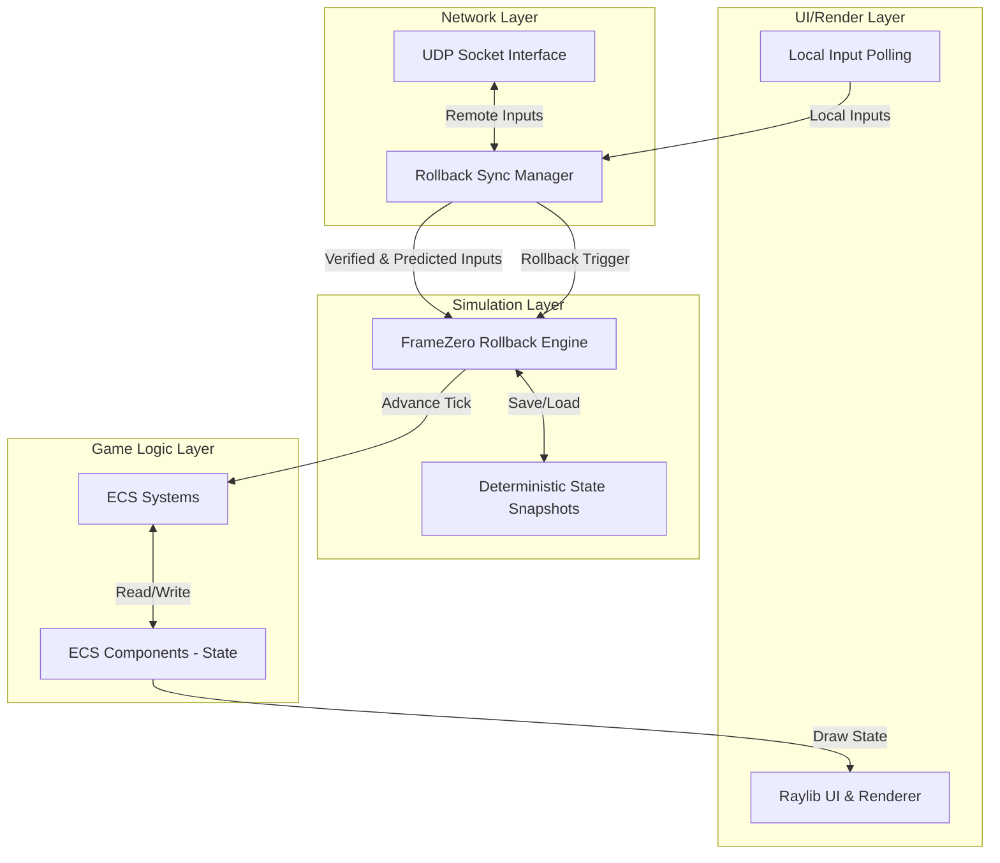

# Architecture Specification: 2D Fighting Game on FrameZero

## 1. Game Concept and Core Loop

### Game Concept
A competitive 2D fighting game designed for precision, responsiveness, and fairness, built on top of the **FrameZero** deterministic rollback physics engine. The game focuses on intense 1v1 combat, utilizing pixel-perfect hitboxes and hurtboxes, fluid animations, and tight input execution.

### Core Loop
The core loop operates on a fixed timestep to ensure determinism across all clients. The sequence per frame is as follows:
1. **Input Polling**: Gather local player inputs via the UI layer (Raylib).
2. **Network Sync**: Send local inputs to the remote opponent and receive their inputs via UDP. If remote inputs are delayed, predict them based on the last known input.
3. **Rollback Condition**: If late inputs arrive and differ from predictions, restore the game state to the frame of the divergence, and rapidly re-simulate forward to the current frame.
4. **Simulation Step**: Advance the game state by one frame (FrameZero).
5. **Game Logic**: Process Entity Component System (ECS) logic (movement, animations, hit detection, health updates).
6. **State Snapshot**: Save the current deterministic state to the snapshot buffer for potential future rollbacks.
7. **Rendering**: Present the current game state to the screen using Raylib.

## 2. Deterministic ECS Architecture

To maintain strict determinism for rollback networking, the Entity Component System (ECS) must adhere to the following principles:
- **Separation of State and Logic**: Components contain only Plain Old Data (POD) to ensure they can be memcopied for instantaneous state snapshots and restorations.
- **Fixed-Point Math**: Floating-point operations must be avoided or strictly controlled to prevent desynchronization across different CPU architectures.

### Entities
- **Characters**: The players' avatars.
- **Projectiles**: Fireballs or thrown objects.
- **Visual Effects (VFX)**: Hit sparks, dust, and visual flourishes (must also be deterministic if they affect the simulation, though pure visual flair can be excluded from state snapshots).

### Core Components (POD)
- `Transform`: Fixed-point position, velocity, and facing direction.
- `Collider`: Bounding boxes defined as Hitboxes (dealing damage) and Hurtboxes (receiving damage).
- `Animator`: Current animation ID, current frame, frame timer, and active flags.
- `FighterState`: Current state (Idle, Walking, Jumping, Attacking, BlockStun, HitStun), health, and meter.
- `InputBuffer`: Ring buffer of recent inputs for the entity.

### Core Systems
- `InputSystem`: Applies current inputs to fighter states.
- `StateSystem`: Handles transitions between different fighter states (e.g., from Attack to Recovery).
- `PhysicsSystem`: Integrates velocity into position and resolves environment collisions.
- `CombatSystem`: Evaluates overlapping Hitboxes and Hurtboxes, applying damage and hit-stop.
- `AnimationSystem`: Advances animation frames based on the current state.

## 3. System Integration Architecture

The following diagram illustrates the flow of data and control between the UI, Network Layer, Simulation, and Game Logic.

